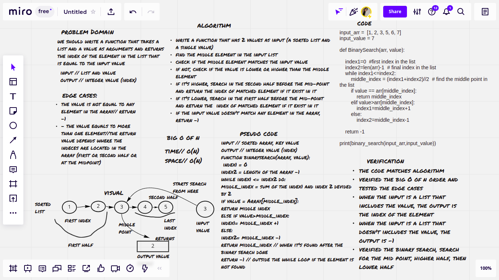

# Binary Search of Sorted Array

his challenge is written with a function that takes a list and a value as arguments and returns the index of the element that equals to the input value, it returns -1 if there is no element equal to this value

## Whiteboard Process

## Approach & Efficiency

- I tried to get the best solution of the problem by checking the edge cases and approaching the solution that would take the minimum time and space, I analyzed the input and their relation to the output and tried to write an algorithm depending on that
- big O of n for time // O(n) -> Linear
  big O of n for space // O(1) -> constant

