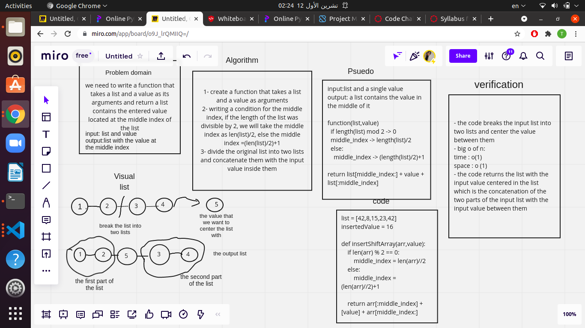

 # Insert to Middle of an Array

this challenge describes a function that takes a list and a value as an input and returns a list with the input value located at the middle of it

## Whiteboard Process

## Approach & Efficiency
- I tried to get the best solution of the problem by approaching the solution that would take the minimum time and space, I analyzed the input and its relation to the output visually and wrote my algorithm and code depending on that
- big O of n for time // O(1) -> constant

  big O of n for space // O(1) -> constant
