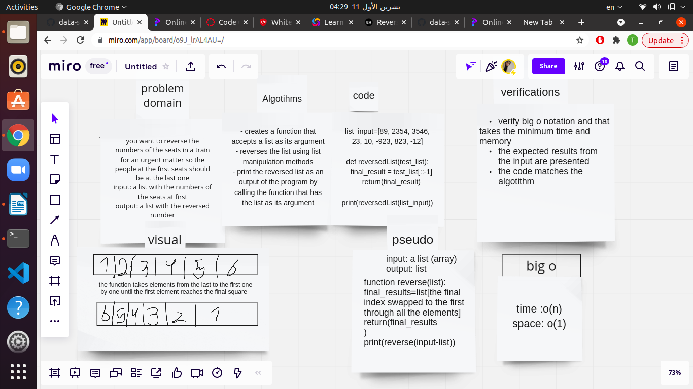

# Reverse an Array

this challenge describes a function that takes an array as an input and returns an array with elements in the reversed order

## Whiteboard Process

## Approach & Efficiency

- I tried to get the best solution of the problem by approaching the solution that would take the minimum time and space, I analyzed the input and their relation to the output and tried to write an algorithm depending on that .
- big O of n for time // O(1) -> constant

  big O of n for space // O(n) -> Linear

