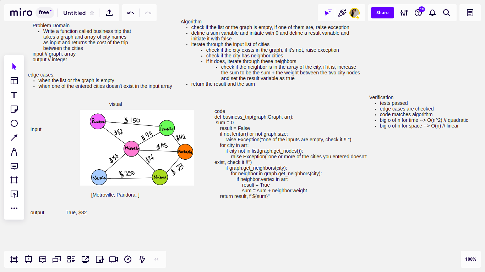

# Challenge Summary
Write a function called business trip that takes a graph and array of city names as input and returns the cost of the trip between the cities

## Whiteboard Process

## Approach & Efficiency

- big O of n for time // O(n^2) -> quadratic
- big O of n for space // O(n) -> linear

## Solution
define a sum variable and initiate with 0 and define a result variable and initiate it with false
iterate through the input list of cities, check if the city has neighbor cities
if it does, iterate through these neighbors
check if the neighbor is in the array of the city, if it is, increase the sum to be the sum + the weight between the two city nodes and set the result variable as true

