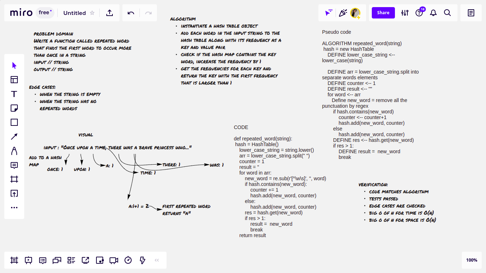

# Hashtables
A HASH TABLE is a data structure that stores values using a pair of keys and values. Each value is assigned a unique key that is generated using a hash function.

## Challenge
Implement a Hashtable Class with the following methods: add, contains, get, hash

## Whiteboard:
repeated-words

## Approach & Efficiency
- for add method:

                    big O of n for time // O(1) -> constant

                    big O of n for space // O(1) -> constant

- for hash method:

                       big O of n for time // O(n) -> linear

                       big O of n for space // O(1) -> constant

-  for get method:

                        big O of n for time // O(n) -> linear

                        big O of n for space // O(1) -> constant

-  for contains method:

                        big O of n for time // O(n) -> linear

                        big O of n for space // O(1) -> constant

-  for repeated_words function:

                        big O of n for time // O(n) -> linear

                        big O of n for space // O(n) -> linear
## API
- hash() method: encrypts a key in the hash table to an index that it's going to be stored in
- add() method: adds a value and a key pairs to the linked list's node that exists in the hash table's bucket
- get() method : gets the value related to an existing key
- contains() method : checks if a key exists in the hash table or not
- repeated_words() function: add each word in the string with its number of occurrences and gets the word with the first occurrence that is larger than 1 and returns it
