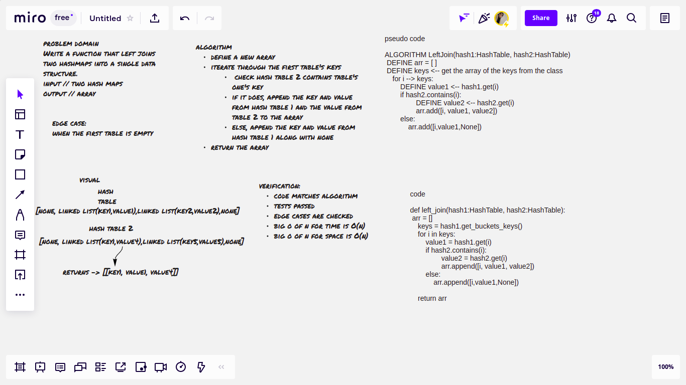

# Challenge Summary
Write a function that LEFT JOINs two hashmaps into a single data structure.

## Whiteboard Process

## Approach & Efficiency
- big O of n for time // O(n) -> linear
- big O of n for space // O(n) -> linear

## Solution
define a new array, iterate through the first table's keys, check hash table 2 contains table's one's key, if it does, append the key and value from hash table 1 and the value from table 2 to the array
else, append the key and value from hash table 1 along with none
