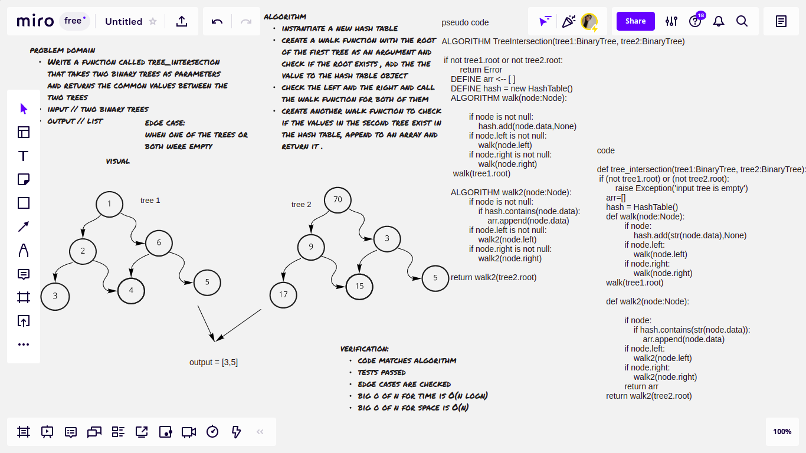

# Challenge Summary
Write a function called tree_intersection that takes two binary trees as parameters.
Using your Hashmap implementation as a part of your algorithm, return a set of values found in both trees.

## Whiteboard Process

## Approach & Efficiency
- big O of n for time // O(nlogn) -> logarithmic
- big O of n for space // O(n) -> linear

## Solution
instantiate a new hash table and create a walk function to add the values in the first tree to it, then create another function to check if the values in the second tree exist in the hashtable, append to an array and return it .
