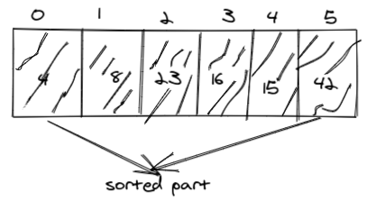
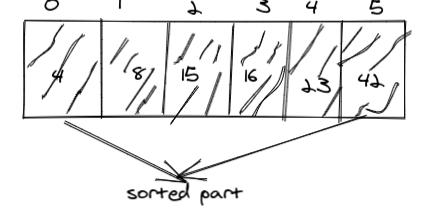

# Insertion Sort

Insertion sort is a simple sorting algorithm that works similar to the way you sort playing cards in your hands. The array is virtually split into a sorted and an unsorted part. Values from the unsorted part are picked and placed at the correct position in the sorted part.

## Pseudocode

```
InsertionSort(int[] arr)

    FOR i = 1 to arr.length

      int j <-- i - 1
      int temp <-- arr[i]

      WHILE j >= 0 AND temp < arr[j]
        arr[j + 1] <-- arr[j]
        j <-- j - 1

      arr[j + 1] <-- temp
```

## Trace

Sample Array: [8,4,23,42,16,15]

#### Pass1:


In the first pass through of the insertion sort, we evaluate if there is a smaller number in the nearest unsorted array element and place it in the index of the first element .

#### Pass2:


the second pass compares the next value in the unsorted part of the array to its nearest elment in the sorted part .

#### pass3:


the third pass checks the remaining elements

#### pass4:



the fourth pass compares the elements of the sorted array

#### pass5:


the fifth pass .

#### pass6:


the sixth pass .

#### pass7:



the eighth pass compares the last two elements in the sorted part of the array and sort them .

## Efficency

- Time: O(n^2)

The basic operation of this algorithm is comparison. This will happen n * (n-1) number of times…concluding the algorithm to be n squared.
Space: O(1)
No additional space is being created. This array is being sorted in place…keeping the space at constant O(1).


