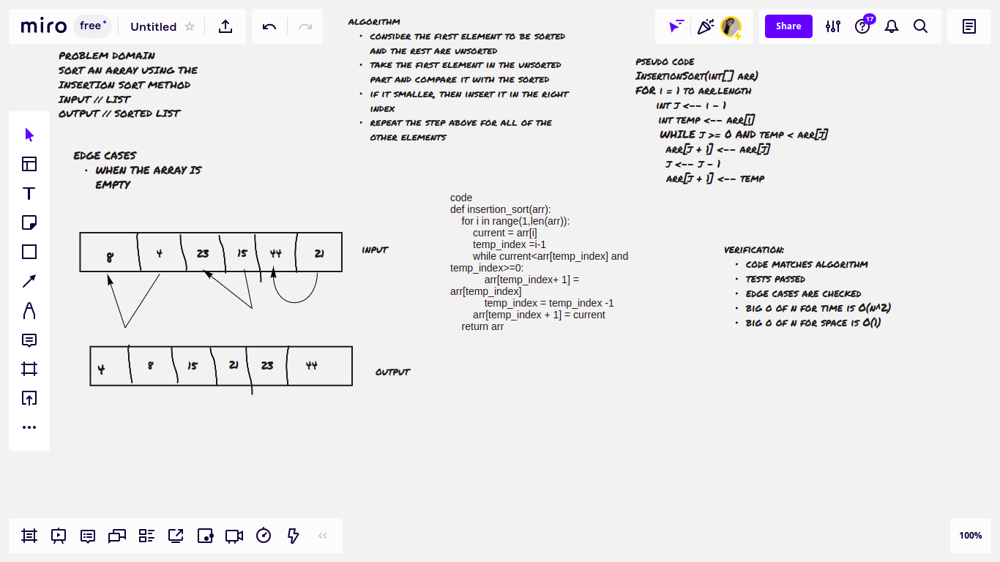

# Challenge Summary
write a function to sort an array using the insertion sort method

## Whiteboard Process

## Approach & Efficiency

- big O of n for time // O(n^2)

- big O of n for space // O(1) -> constant

## Solution
Split the array is virtually into a sorted and an unsorted part. Values from the unsorted part are picked and placed at the correct position in the sorted part.
