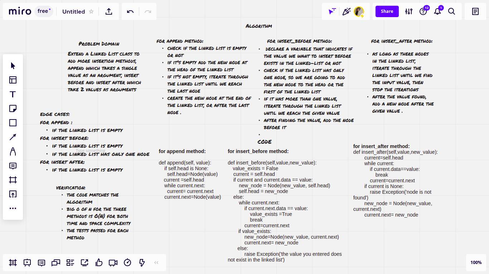
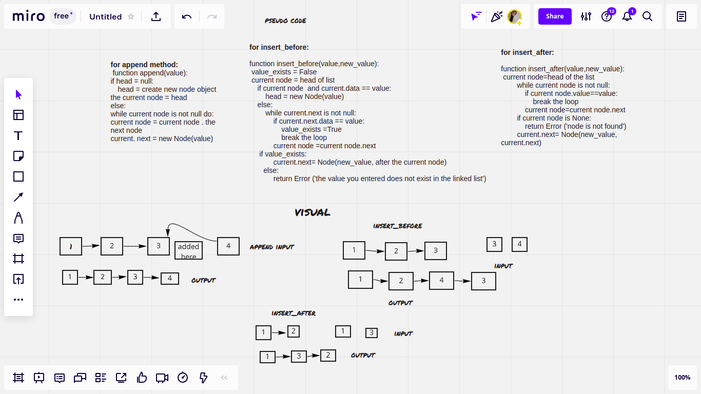
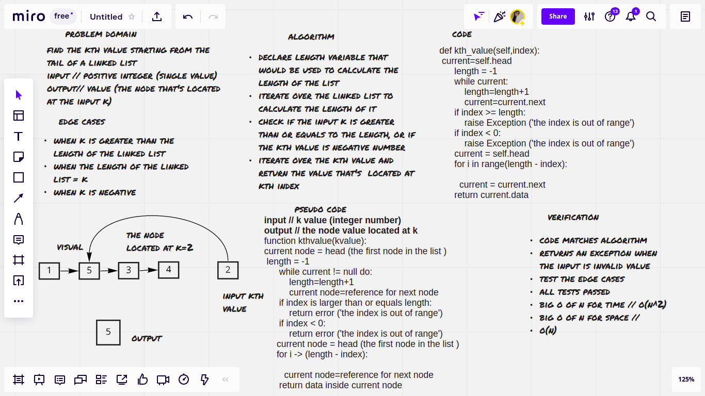

# Singly Linked List
singly linked list describes a linked list that only moves in one direction

## Challenge
- create a singly linked list with inserting a new node into it, check existing values, and a string that represents all the values in the linked list, extending the class by adding more insertion methods to it .
- add the kth value from the end to it, which the index of certain node starting from the tail of the linked list

## Whiteboard Process
insertions

kth value

## Approach & Efficiency
- create a class for the linked list
- create a constructor function to implement data in the first node, create functions to add new nodes, check whether values exist or not and print all of the values as a string .
- for insert method:

                    big O of n for time // O(1) -> constant

                    big O of n for space // O(1) -> constant

- for includes method:

                       big O of n for time // O(1) -> linear

                       big O of n for space // O(1) -> constant

-  for includes method:

                        big O of n for time // O(n) -> linear

                        big O of n for space // O(n) -> linear
-  for append method:

                       big O of n for time // O(1) -> linear

                       big O of n for space // O(n) -> linear

-  for insert_before method:

                        big O of n for time // O(n) -> linear

                        big O of n for space // O(n) -> linear
-  for insert_after method:

                        big O of n for time // O(n) -> linear

                        big O of n for space // O(n) -> linear

- for kth_value method:

                        big O of n for time // O(2n) -> linear

                        big O of n for space // O(n) -> linear

## API
- insert() method: adds a new node .
- includes() method: returns a boolean that indicates if a node has a certain value or not
- to_string method : show all the values that were inserted in the linked list as a string
- append() method : add a new node to the end of the linked list
- insert_before() method: add a new node before a node that has a given value in the linked list
- insert_after() method: add a new node after a node that has a given value in the linked list
- kth_value() method: returns the value in the node located at the index of the linked list if we started from the end of it (input // kth value from the end -> positive integer

                                       output // the value located at the kth index)

