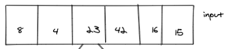
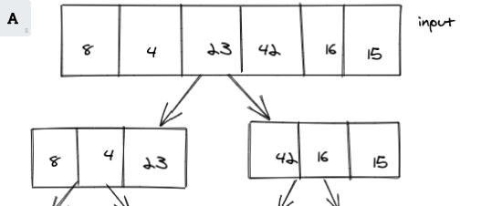
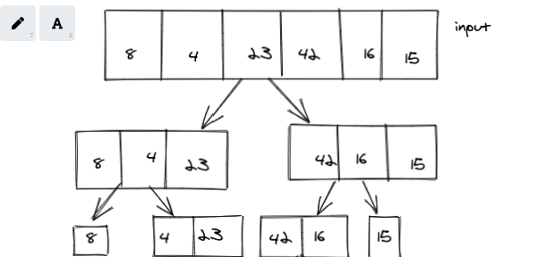
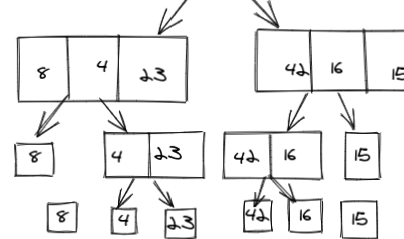
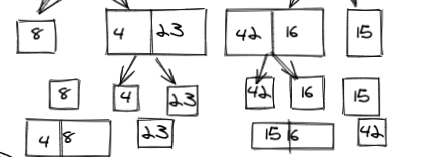
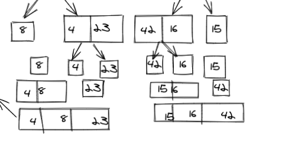
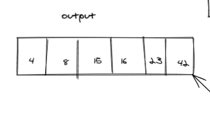

# Merge Sort

Merge Sort is a Divide and Conquer algorithm. It divides input array in two halves, calls itself for the two halves and then merges the two sorted halves. The merge() function is used for merging two halves.

## Pseudocode

```

ALGORITHM Mergesort(arr)
    DECLARE n <-- arr.length

    if n > 1
      DECLARE mid <-- n/2
      DECLARE left <-- arr[0...mid]
      DECLARE right <-- arr[mid...n]
      // sort the left side
      Mergesort(left)
      // sort the right side
      Mergesort(right)
      // merge the sorted left and right sides together
      Merge(left, right, arr)

ALGORITHM Merge(left, right, arr)
    DECLARE i <-- 0
    DECLARE j <-- 0
    DECLARE k <-- 0

    while i < left.length && j < right.length
        if left[i] <= right[j]
            arr[k] <-- left[i]
            i <-- i + 1
        else
            arr[k] <-- right[j]
            j <-- j + 1

        k <-- k + 1

    if i = left.length
       set remaining entries in arr to remaining values in right
    else
       set remaining entries in arr to remaining values in left
```

## Trace

Sample Array: [8,4,23,42,16,15]

#### Pass1:





In the first pass through of the merge sort, the array is split into two halves, left and right

#### Pass2:



the second pass splits the two resulted halves from the first pass, depending on the middle point .

#### pass3:



the third pass splits each element in the array to a separate array

#### pass4:



the fourth pass merges the split elements after sorting them, starting from the nearest ones

#### pass5:



the fifth pass merges the elements into two sorted arrays

#### pass6:



the sixth pass returns the original length of the array with a sorted order .

## Efficency

- Time: O(nlogn)

The basic operation of this algorithm is recursion. This will happen n * (n-1) number of times .

Space: O(1)
No additional space is being created. This array is being sorted in place…keeping the space at
constant O(1).


