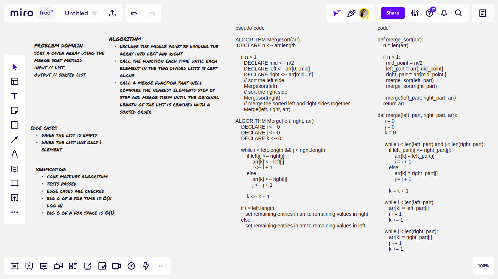
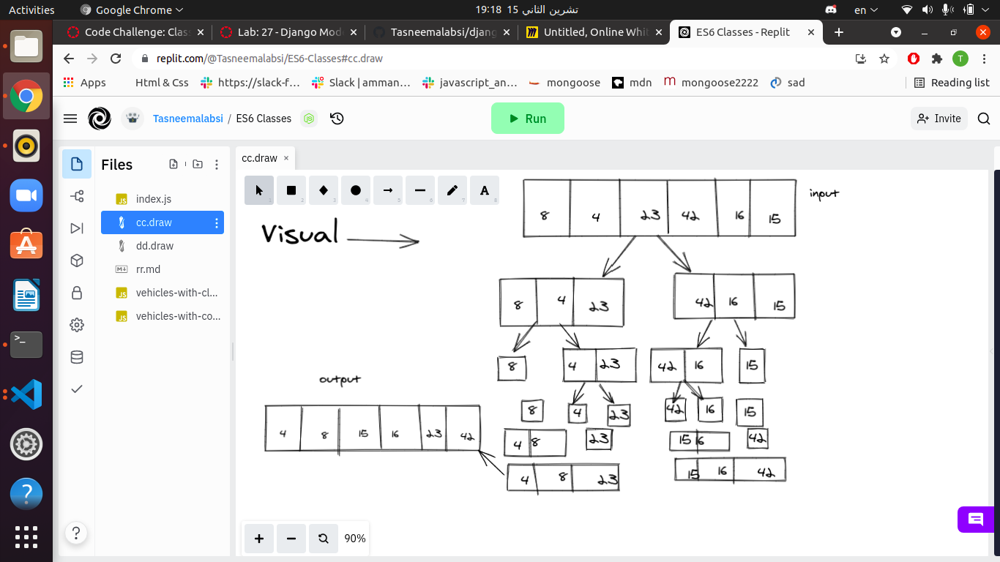

# Challenge Summary
write a function to sort an array using the merge sort method

## Whiteboard Process

 Visual

## Approach & Efficiency

- big O of n for time // O(nlogn) -> logarithmic

- big O of n for space // O(1) -> constant

## Solution
Divide input array in two halves, call  the merge sort inside itself for the two halves and then merges the two sorted halves.
