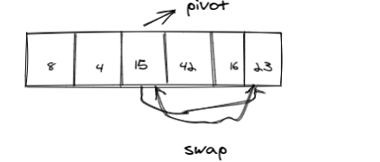
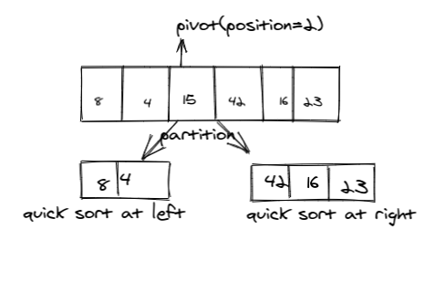

# Quick Sort

Quick sort is a highly efficient sorting algorithm and is based on partitioning of array of data into smaller arrays. A large array is partitioned into two arrays one of which holds values smaller than the specified value, say pivot, based on which the partition is made and another array holds values greater than the pivot value.

## Pseudocode

```
ALGORITHM QuickSort(arr, left, right)
    if left < right
        // Partition the array by setting the position of the pivot value
        DEFINE position <-- Partition(arr, left, right)
        // Sort the left
        QuickSort(arr, left, position - 1)
        // Sort the right
        QuickSort(arr, position + 1, right)

ALGORITHM Partition(arr, left, right)
    // set a pivot value as a point of reference
    DEFINE pivot <-- arr[right]
    // create a variable to track the largest index of numbers lower than the defined pivot
    DEFINE low <-- left - 1
    for i <- left to right do
        if arr[i] <= pivot
            low++
            Swap(arr, i, low)

     // place the value of the pivot location in the middle.
     // all numbers smaller than the pivot are on the left, larger on the right.
     Swap(arr, right, low + 1)
    // return the pivot index point
     return low + 1

ALGORITHM Swap(arr, i, low)
    DEFINE temp;
    temp <-- arr[i]
    arr[i] <-- arr[low]
    arr[low] <-- temp
```

## Trace

Sample Array: [8,4,23,42,16,15]

#### Pass1:


In the first pass sets the highest index value as the pivot and compares it with the other array's value

#### Pass2:



the second pass swaps between 15 and 23, because 23 is larger

#### pass3:



in the third pass, we have all of the elements that are smaller than the pivot on the left and and the elements that are larger at the right, now where the partition happens and a quick sort hapens for the left and right parts

#### pass4:


4 is pivot
the fourth pass repeats the quick sort for the left part, swaps between 4 and 8 since 8 is larger, now we have the left part all sorted

#### pass5:


the fifth pass repeats the quick sort for the right part, swaps between 23 and 42 since 42 is larger. 23 is the pivot here .

#### pass6:


the sixth pass continues with sorting the right part, it swaps between 16 and 23, now we have the right part all sorted .

#### pass7:


in the seventh pass, we have the array sorted by the quick sort method .


## Efficency

- Time: O(nlogn)

The basic operation of this algorithm is recursion. This will happen n * (n-1) number of times .

Space: O(1)
No additional space is being created. This array is being sorted in place…keeping the space at
constant O(1).


