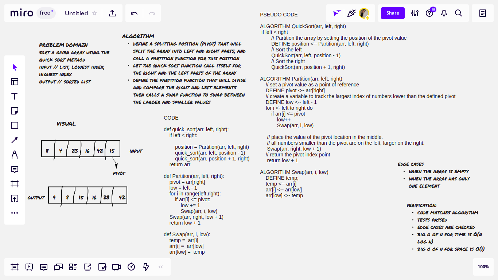

# Challenge Summary
write a function to sort an array using the quick sort method

## Whiteboard Process

## Approach & Efficiency

- big O of n for time // O(nlogn) -> logarithmic

- big O of n for space // O(1) -> constant

## Solution
Divide input array in two parts based on the position of the selected pivot, call  the quick sort inside itself for the two parts and then sort the two parts. 
