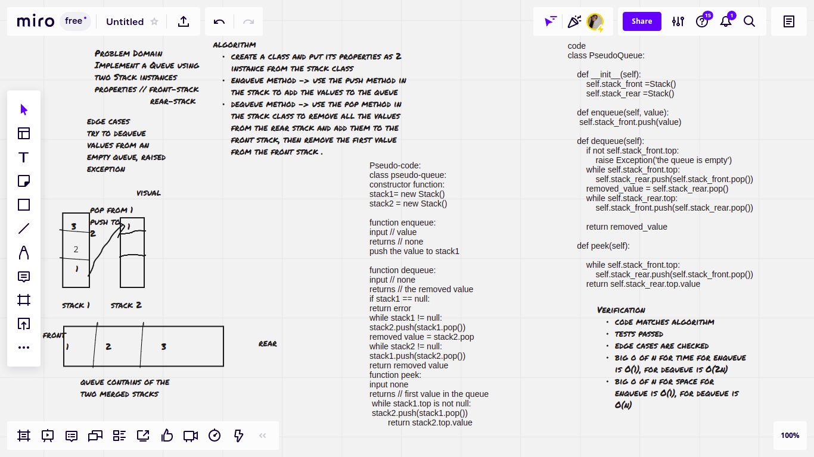

# Stacks and Queues
stack is a type of data structure that stores data as nodes, the first node in is last out (FILO concept) and last in first out (LIFO concept)

queue is a type of data structure that stores data as nodes, the first node in is first out (FIFO concept) and last in last out (LILO concept)

## Challenge
Implement a stack and a queue with their methods adding, removing and getting the top or rear values.

The Psuedo queue challenge requires creating a queue class using two stacks.

The animal shelter challenge has an animal shelter class which properties are a dog queue and a cat queue which are instances of the Queue class, it should have enqueue and dequeue method to add and remove cat and dogs from their own queues

## Whiteboard Process
Pseudo-queue

## Approach & Efficiency
- create classes for stack and queue
- create an init function to implement data in the first node, create methods to add new nodes, check whether the stack or the queue is empty or not and getting the values in the top or rear nodes
- for push/enqueue method:

                    big O of n for time // O(1) -> constant

                    big O of n for space // O(n) -> linear

- for pop/dequeue method:

                       big O of n for time // O(1) -> constant

                       big O of n for space // O(n) -> linear

-  for is_empty method:

                        big O of n for time // O(1) -> constant

                        big O of n for space // O(1) -> constant
-  for peek method:

                       big O of n for time // O(1) -> constant

                       big O of n for space // O(1) -> constant
- for enqueue in Psudo-queue:

                       big O of n for time // O(1) -> constant

                       big O of n for space // O(1) -> constant
- for dequeue in Psudo-queue:

                       big O of n for time // O(n) -> linear

                       big O of n for space // O(n) -> linear

## API

- push()/enqueue() method: adds a new node located at the top in a stack and at the rear in queue
- pop()/dequeue() method: removes a node located at the top in a stack and at the front in the queue and returns the value in the removed node
- is_empty() method : returns True if the stack or the queue is empty, otherwise returns false
- peek() method : returns the value in the top of a stack and the rear of a queue
- enqueue method in psuedo-queue challenge : adds a value to the queue using the push method in the stack instance
- dequeue method in pseudo-queue challenge: removes the first value in the queue using push and pop methods from the stack instances
- peek method in the psudo-queue challenge: used to test the enqueue method, linear time complexity, constant space complexity
