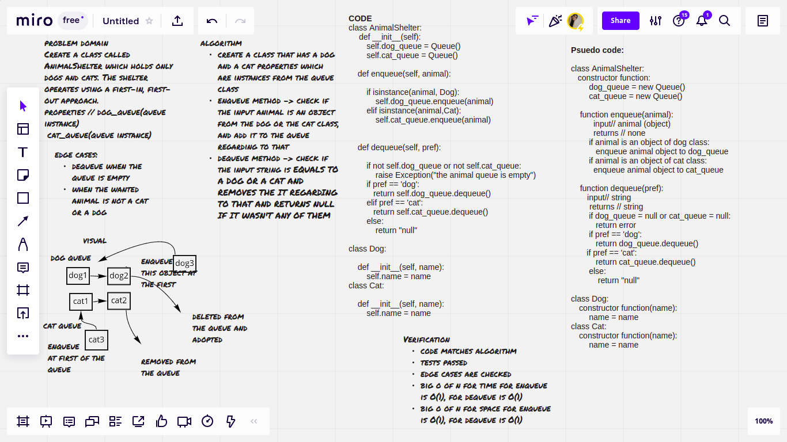

# Challenge Summary

Create a class called AnimalShelter which holds only dogs and cats. The shelter operates using a first-in, first-out approach.

## Whiteboard Process

## Approach & Efficiency
- create an animal shelter class that has a dog queue and a cat queue attributes
- create a dog and a cat classes to create an object once we want to add an animal to the queue
- for enqueue method:

                       big O of n for time // O(1) -> constant

                       big O of n for space // O(1) -> constant
- for dequeue method:

                       big O of n for time // O(1) -> constant

                       big O of n for space // O(1) -> constant

## Solution
- enqueue method in Animal-shelter challenge : adds a dog or cat object to the queue, with two conditions that determine if the added animal is an instance of the dog or the cat class
- dequeue method in Animal-shelter challenge: removes the first dog or cat in the queue depending on the preferred animal (if it was a dog or a cat), and returns null if the preferred animal wasn't a dog or a cat.
