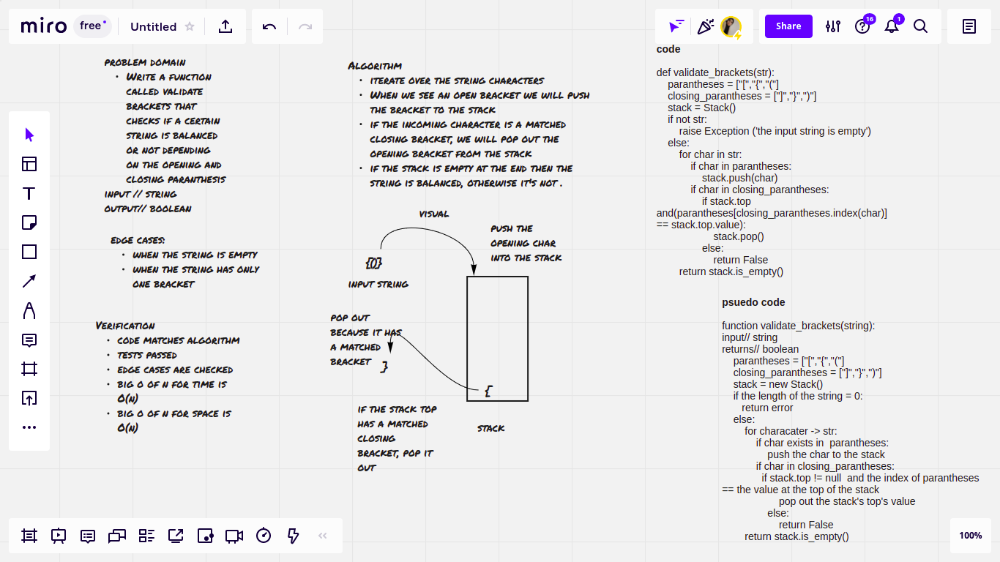

# Challenge Summary

Write a function called validate brackets that checks whether a given string is balanced or not, if every opening bracket has a relatively closing one, then the string is balanced and returns true, otherwise returns false

## Whiteboard Process

## Approach & Efficiency
- create a function to check the input string
- discuss the edge cases and write tests for all of the
- compare the actual values to the expected ones
- big O of n for time // O(n) -> linear
- big O of n for space // O(n) -> linear

## Solution
instantiate a new stack and iterate through the string characters, and push the opening brackets into the stack and popping them out if they have matched closing brackets, if the stack is empty at the end then the string is balanced, otherwise it's not .
