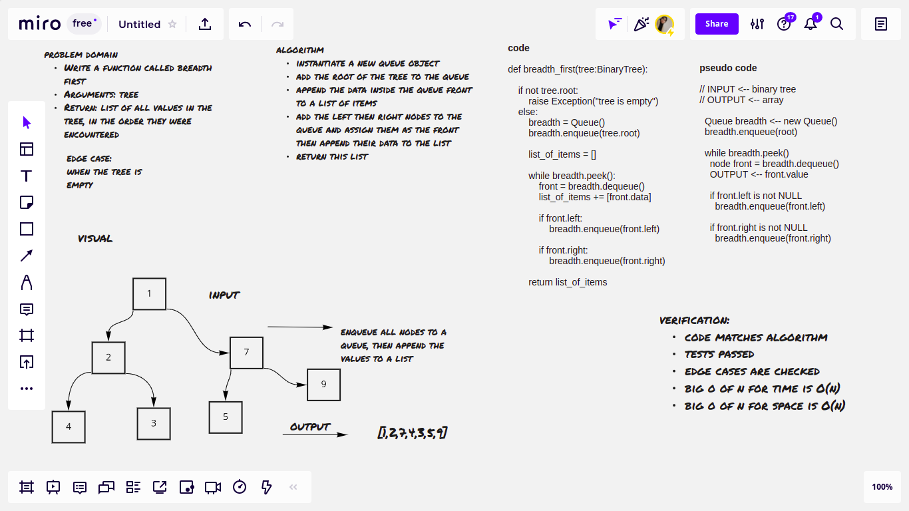
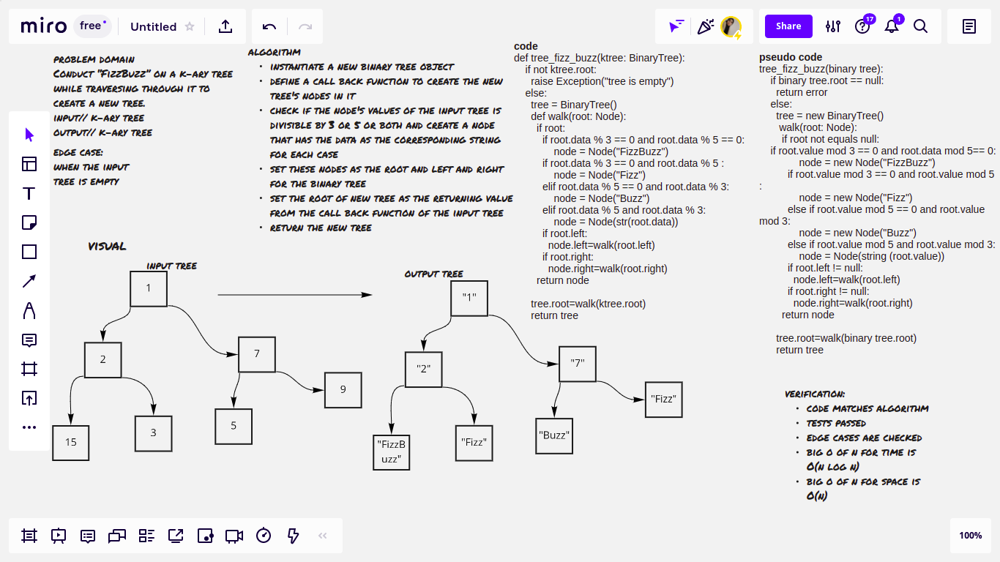

# Trees

Trees are non-linear data structures, a tree whose elements have at most 2 children is called a binary tree.

## Challenge
Create a Node class that has properties for the value stored in the node, the left child node, and the right child node. And create a Binary Tree class

the tree max challenge, write a method in the binary tree class that returns the maximum value in the tree

the breadth first challenge: Write a function called breadth first that takes a binary tree as an argument and returns a list of all values in the tree, in the order they were encountered

the tree fizz buzz challenge: Conduct “FizzBuzz” on a k-ary tree while traversing through it to create a new tree. Set the values of each of the new nodes depending on the corresponding node value in the source tree.

## Whiteboard Process
tree max

breadth first challenge:

tree fizz buzz challenge:

## Approach & Efficiency
- create a class for the Node
- Create a class for the binary tree which has these methods:
    - bfs method(breadth first): returns the items of the tree as a list in the breadth first order

                    big O of n for time // O(n) -> linear

                    big O of n for space // O(n) -> linear

    - pre order method: returns the items of the tree as a list in the pre-order

                        big O of n for time // O(nlogn) -> logarithmic

                        big O of n for space // O(n) -> linear

    - in-order method: returns the items of the tree as a list in the in-order

                        big O of n for time // O(nlogn) -> logarithmic

                        big O of n for space // O(n) -> linear
    - post order method: returns the items of the tree as a list in the post-order

                        big O of n for time // O(nlogn) -> logarithmic

                        big O of n for space // O(n) -> linear
    - get_max method: returns the maximum value in the tree

                        big O of n for time // O(n) -> linear

                        big O of n for space // O(n) -> linear

- Create a class for the binary search tree which has these methods:
    - add method: adds nodes to the tree, either to the root if the tree was empty at first, or to the left if the added node's value was smaller than the root node's value, or to the right if the node's value was larger than the root node's value .

                    big O of n for time // O(n) -> linear

                    big O of n for space // O(1) -> constant

    - contains method: returns true if the given value exists in the tree, otherwise returns false

                        big O of n for time // O(n) -> linear

                        big O of n for space // O(1) -> constant
- breadth_first function: returns a list with the items of a tree

                        big O of n for time // O(n) -> linear

                        big O of n for space // O(n) -> linear
- tree_fizz_buzz function: returns a new binary tree with the modified value according to the fizz buzz pattern
                        big O of n for time // O(nlogn) -> logarithmic

                        big O of n for space // O(n) -> linear

## API
- bfs() method: returns the items of the tree as a list in the breadth first order
- pre_order() method: returns the items of the tree as a list in the pre-order
- in_order() method :returns the items of the tree as a list in the in-order
- post_order() method : returns the items of the tree as a list in the post-order
- add() method: adds nodes to the tree, either to the root if the tree was empty at first, or to the left if the added node's value was smaller than the root node's value, or to the right if the node's value was larger than the root node's value .
- contains() method: returns true if the given value exists in the tree, otherwise returns false
- get_max() method: returns the maximum value in a binary tree, it has no arguments, it's called by an instance of a binaryTree class .
- breadth_first function: returns a list with the items of a tree after dequeuing them from a queue of the tree nodes that were added to it before
- tree_fizz_buzz function: takes a binary tree as an input and replaces the node value with 'fizz' if the node's value is divisible by 3, 'buzz' if it's divisible by 5, and fizzbuzz if it's divisible by both, if none it replaces it with the number as a string, it returns a new binary tree with the values modified according to the mentioned fizz buzz pattern. 
