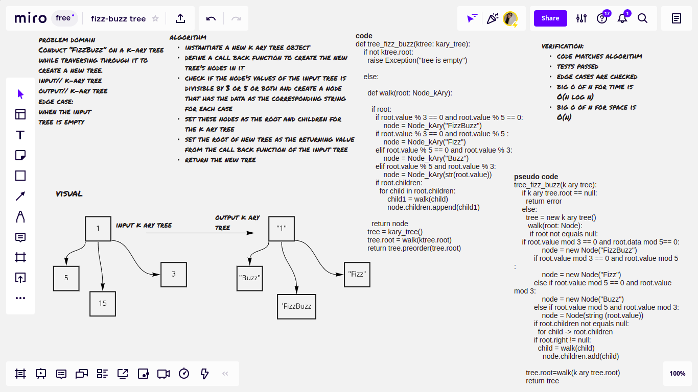

# Challenge Summary

Conduct “FizzBuzz” on a k-ary tree while traversing through it to create a new tree. Set the values of each of the new nodes depending on the corresponding node value in the source tree.

## Whiteboard Process

## Approach & Efficiency
Node_kAry.add_child():

                        big O of n for time // O(1) -> constant

                        big O of n for space // O(1) -> constant
kary_tree.preorder():

                        big O of n for time // O(n) -> linear

                        big O of n for space // O(n) -> linear

tree_fizz_buzz: returns a new k ary tree with the modified value according to the fizz buzz pattern

                        big O of n for time // O(nlogn) -> logarithmic

                        big O of n for space // O(n) -> linear

## Solution

tree_fizz_buzz function: takes a k_ary tree as an input and replaces the node value with 'fizz' if the node's value is divisible by 3, 'buzz' if it's divisible by 5, and fizzbuzz if it's divisible by both, if none it replaces it with the number as a string, it returns a new k_ary tree with the values modified according to the mentioned fizz buzz pattern.

